# Procesverslag
Markdown is een simpele manier om HTML te schrijven.  
Markdown cheat cheet: [Hulp bij het schrijven van Markdown](https://github.com/adam-p/markdown-here/wiki/Markdown-Cheatsheet).

Nb. De standaardstructuur en de spartaanse opmaak van de README.md zijn helemaal prima. Het gaat om de inhoud van je procesverslag. Besteedt de tijd voor pracht en praal aan je website.

Nb. Door *open* toe te voegen aan een *details* element kun je deze standaard open zetten. Fijn om dat steeds voor de relevante stuk(ken) te doen.

## Jij

  
uitwerken voor kick-off werkgroep

  ### Auteur:
Aya Alnabelsi 
  #### Je startniveau:
Blauw 
  #### Je focus:
Responsive 

## Je website

  
uitwerken voor kick-off werkgroep

  ### Je opdracht:
  https://www.benefitcosmetics.com/nl-nl 
  Ik wil de homepage en de behandelingenpage namaken.
  Mijn focus ligt op responsiviteit.

  #### Screenshot(s) van de eerste pagina (small screen): 
  HOMEPAGE
  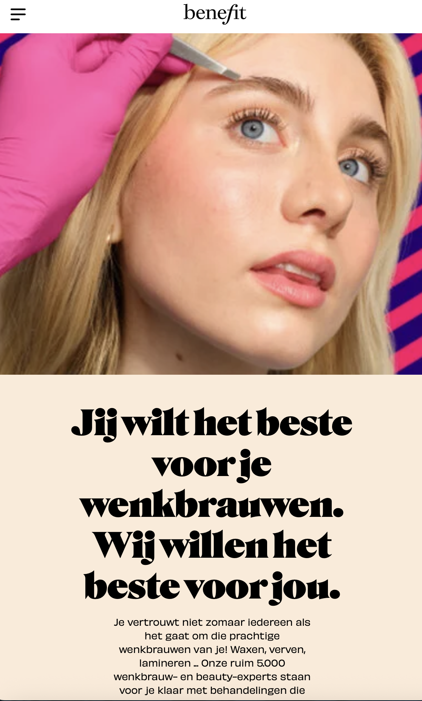

  #### Screenshot(s) van de tweede pagina (small screen):
  BEHANDELINGENPAGE
  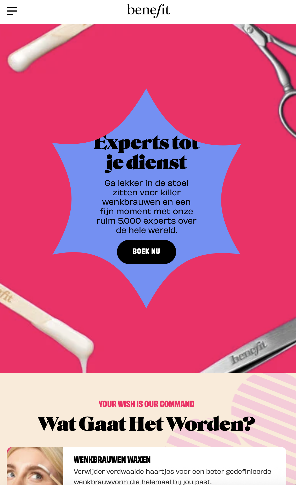
 

## Toegankelijkheidstest 1/2 (week 1)

  
uitwerken na test in 2e werkgroep

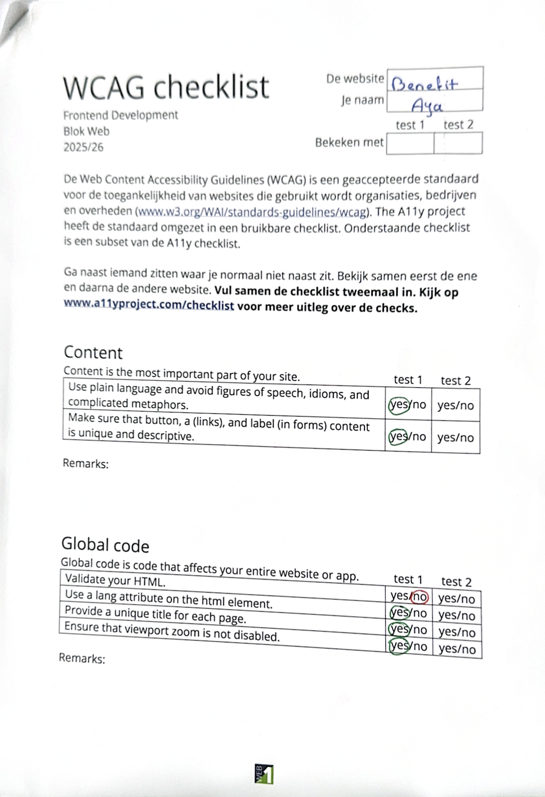
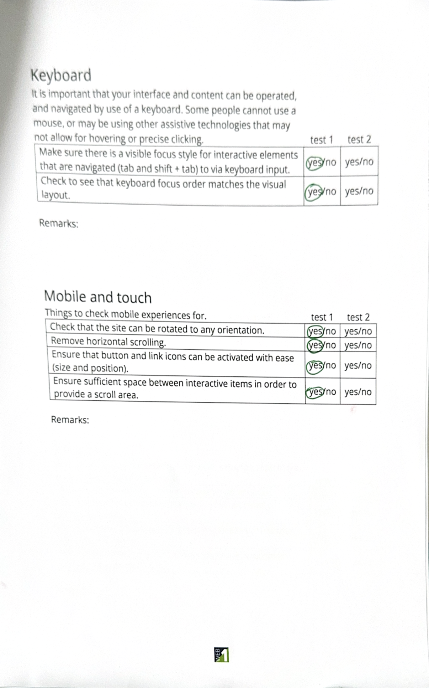
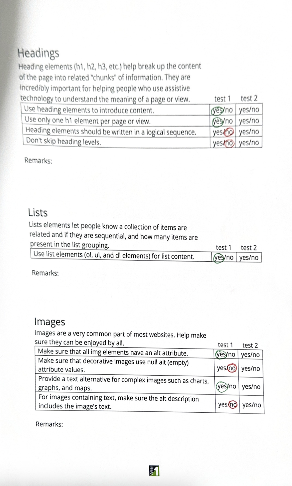
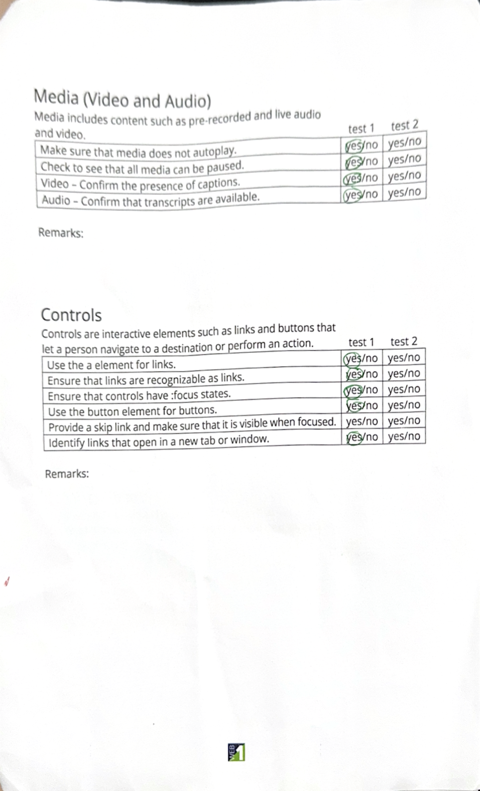
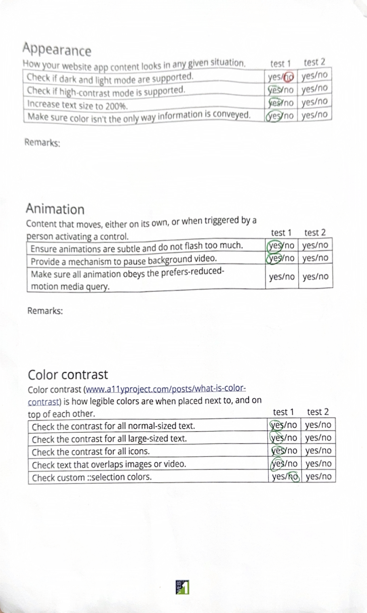

  ### Bevindingen
Bevindingen van punten die nog niet zijn toegepast
- Valideer je HTML-code.
- Koptekstelementen heading moeten in een logische volgorde worden geschreven.
Sla geen kopniveau’s over bijv. niet van h1 naar h3 
- Zorg dat decoratieve afbeeldingen een lege alt-tekst hebben.
- Voor afbeeldingen die tekst bevatten, moet de alt beschrijving dezelfde tekst bevatten.
- Controleer of zowel donkere als lichte modus worden ondersteund.

## Breakdownschets (week 1)

  
uitwerken na afloop 3e werkgroep

  ### de hele pagina: 
  
    

## Voortgang 1 (week 2)

  
uitwerken voor 1e voortgang

  ### Stand van zaken
  hier dit ging goed & dit was lastig (neem ook screenshots op van delen van je website en code)

  Wat ik momenteel lastig vind bij het coderen van de website zijn de volgende onderdelen:

  1- Het coderen van de agenda functionaliteit (Boek nu button)
  

  2- Het animeren van de p tekst
  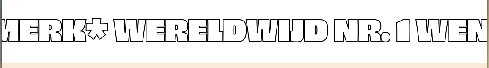

  3- Het stylen van productenfoto's + het animeren van de achtergrond 
  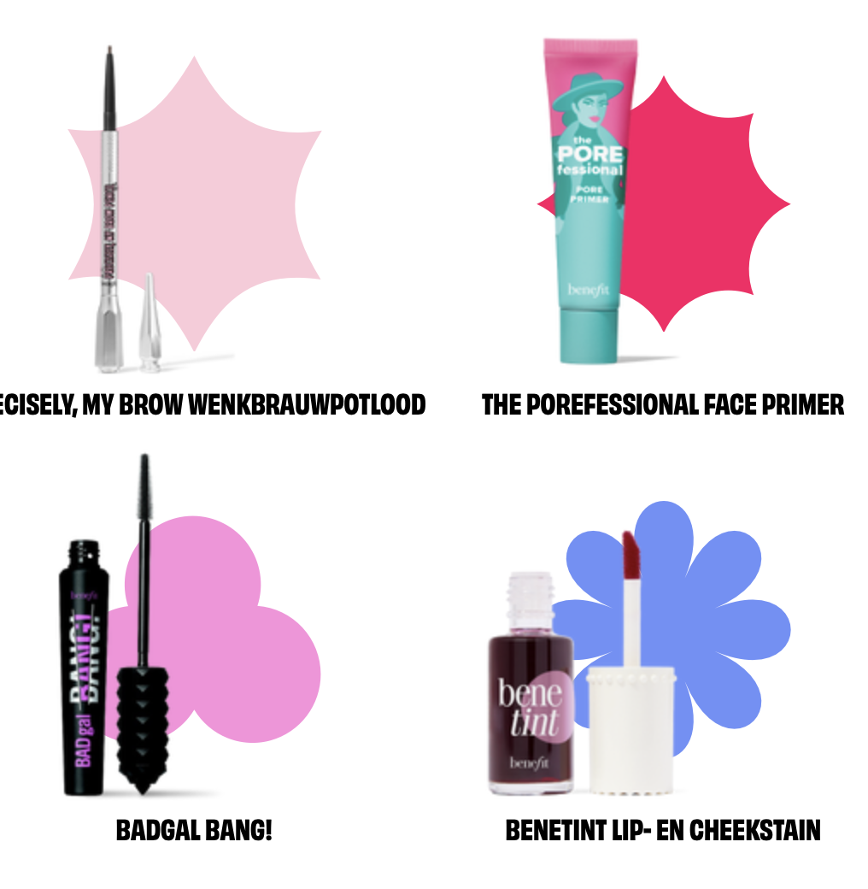

  4- Het aanpassen van het contrast van de social media icons

  

  ### Agenda voor meeting
  samen met je groepje opstellen

  Student 1 Aya| Menu,Section bestellers Het programmeren van de agenda functionaliteit, Het animeren van de bewegende paragraaftekst, Het stylen van de productfoto’s, inclusief de animatie op de achtergrond, Het aanpassen van het contrast van de socialmedia iconen.

  Student 2 Patoune| Video toegankelijk maken

  Student 3 Kyra| grid (afbeeldingen en tekst responsive krijgen) en hoe ik een kleine animatie krijg van iets wat geen afbeelding is en ik heb nog een vraag over hoe ik bepaalde afbeeldingen en tekst kan aanspreken die in een section zitten.  

  Student 4 Randi| Header

  ### Verslag van meeting
  hier na afloop snel de uitkomsten van de meeting vastleggen

  - Goeie alt tekst geven
  - Artickels een Hedding geven
  - a href leeg laten 

## Voortgang 2 (week 3)

  
uitwerken voor 2e voortgang

  ### Stand van zaken
 ik vond het lastig om 2 images tegelijkertijd binnen een artickel element te stijlen

  ### Agenda voor meeting
  samen met je groepje opstellen

  Student 1 Aya| Of het toegestaan is om 2 images binnen 1 artickel te hebben, waarvan 1 als achtergrond img.2 images op de echte website met de juiste kleur downloaden en hoe ik de contrast van socialmedia iconen met css kan laten veranderen

  Student 2 Patoune| afbeeldingen horizontaal kan laten scrollen

  Student 3 Kyra| Afbeeldingen positioneren op mijn home page en hoe ik dat in een grid kan doen. Hoe ik de animatie het best kan maken.

  Student 4 Joost| Ik wil graag kijken hoe ik mijn nav kan vormgeven als een responsive raster. Daarnaast wil ik nog ff kijken naar mijn grid en hoe ik daarin dingen kan gaan plaatsen
 

  ### Verslag van meeting
  hier na afloop snel de uitkomsten van de meeting vastleggen

  - punt geen hoofdletters gebruiken in html
  - punt alle sections een h2/3 geven

## Toegankelijkheidstest 2/2 (week 4)

  
uitwerken na test in 9e werkgroep

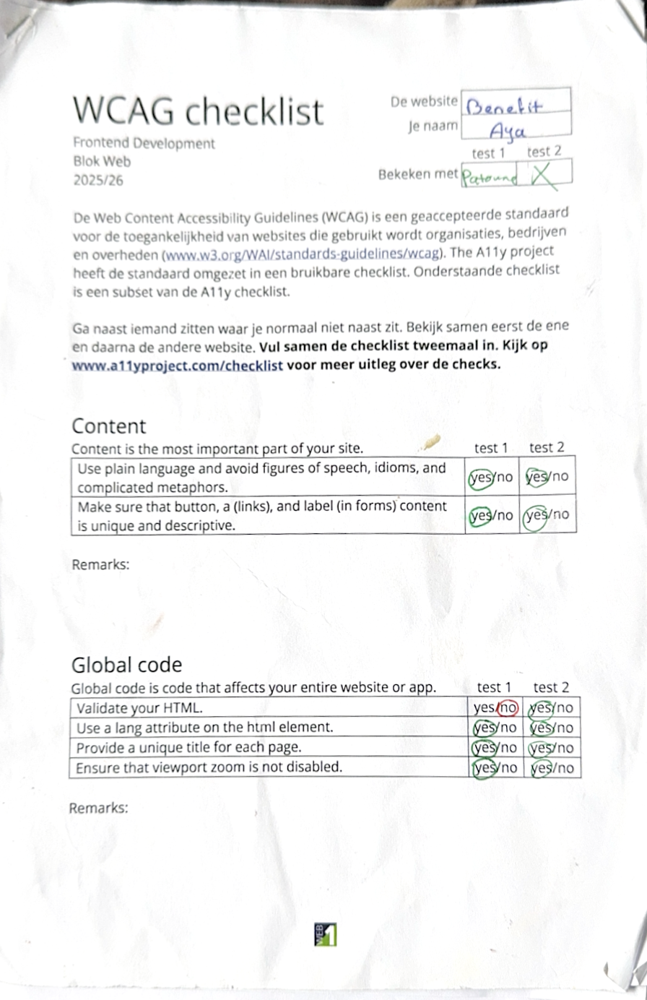
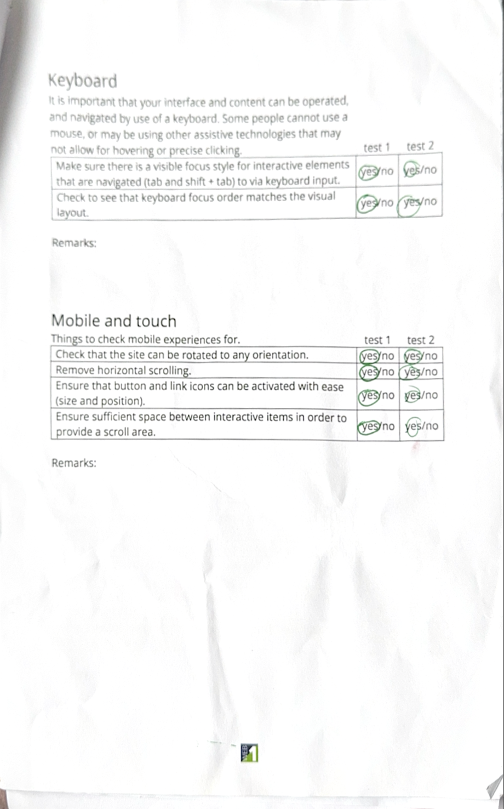
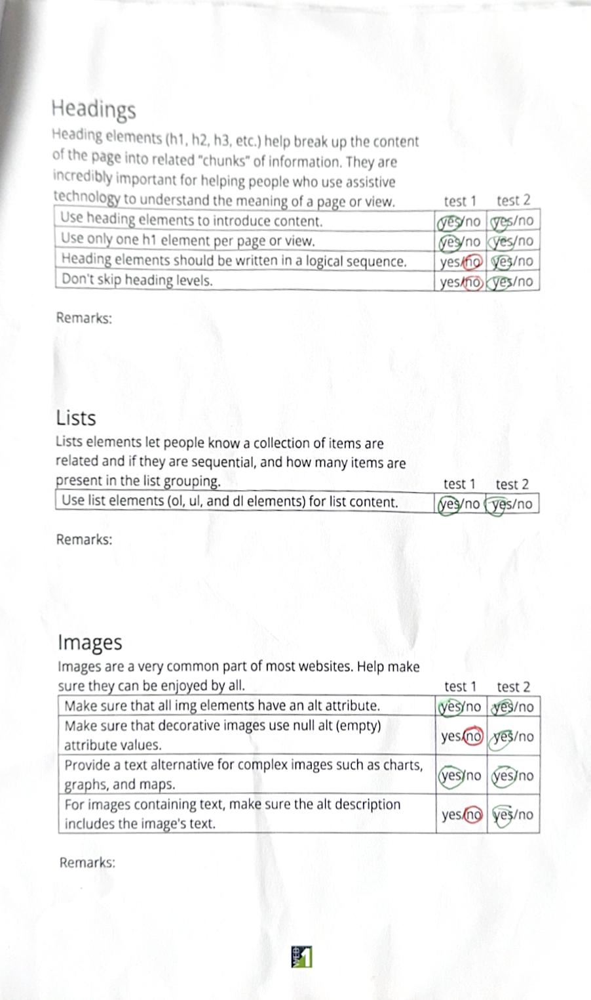
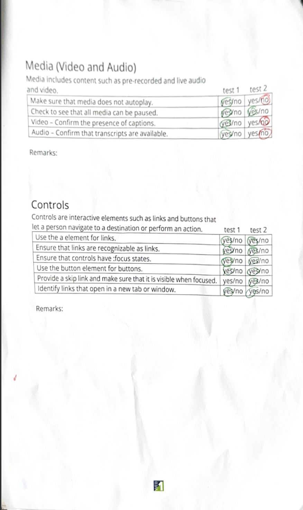
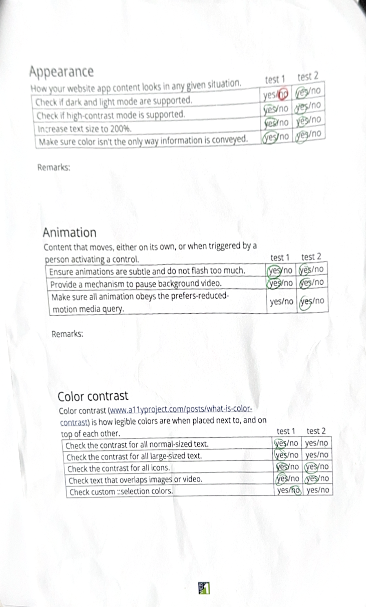

  ### Bevindingen
  Lijst met je bevindingen die in de test naar voren kwamen (geef ook aan wat er verbeterd is)

(Wat er verbeterd is)
- Valideer je HTML-code.
- Koptekstelementen heading moeten in een logische volgorde worden geschreven.
- Sla geen kopniveau’s over bijv. niet van h1 naar h3 
- Zorg dat decoratieve afbeeldingen een lege alt-tekst hebben.
- Voor afbeeldingen die tekst bevatten, moet de alt beschrijving dezelfde tekst bevatten.
- Controleer of zowel donkere als lichte modus worden ondersteund.

## Voortgang 3 (week 4)

  
uitwerken voor 3e voortgang

  ### Stand van zaken
  hier dit ging goed & dit was lastig (neem ook screenshots op van delen van je website en code)

  ### Agenda voor meeting
  samen met je groepje opstellen

  Student 1 Aya| grid fixen, contrast iconen met javascript

  Student 2 Patoune|  Hoe zet ik een video in mijn html met controls. En hoe style ik de summary’s in m’n footer

  Student 3 Kyra| afbeeldingen positioneren op mijn home page en hoe ik dat in een grid kan doen. En hoe ik de animatie het best kan maken. En voor morgen wil ik graag weten hoe ik mijn search balk in mijn hamburger menu krijg en hoe ik onderin mijn pagina de cursor kan laten meebewegen en hoe ik als je over bepaalde knoppen hovered er een soort bolletje te zien is.

  Student 4 Joost|  

  ### Verslag van meeting
  hier na afloop snel de uitkomsten van de meeting vastleggen

  - iconen als svg gebruiken
  - 1 root gebruiken voor algemene kleuren en darmode
  

## Eindgesprek (week 5)

  
uitwerken voor eindgesprek

  ### Je uitkomst - karakteristiek screenshots:
  

  ### Dit ging goed/Heb ik geleerd: 
  Korte omschrijving met plaatjes
  Ik heb geleerd hoe ik een video element kan toepassen. Daarnaast heb ik veel met grid geoefend en mezelf daarin verder ontwikkeld. Met behulp van de studentassistent heb ik geleerd hoe ik het contrast van socialmedia iconen kan aanpassen en hoe ik geanimeerde tekst kan creëren. Ook heb ik van Sanne geleerd hoe ik animaties kan toepassen, zoals draaien, stoppen en andere effecten.
    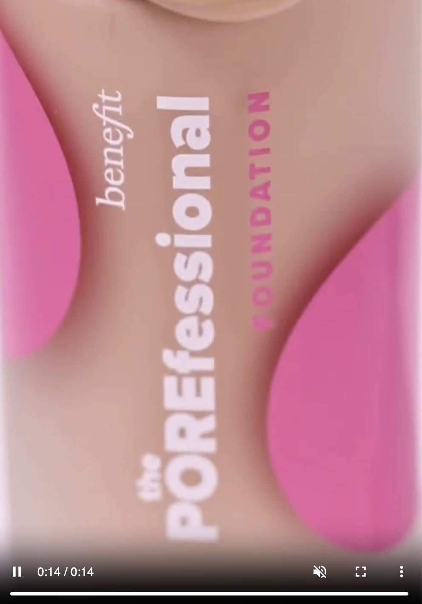
    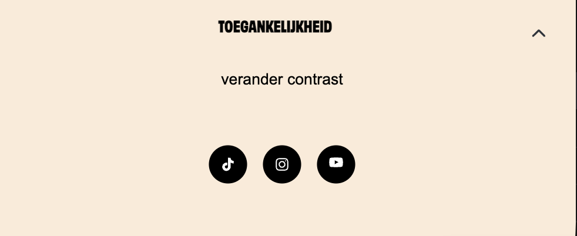
    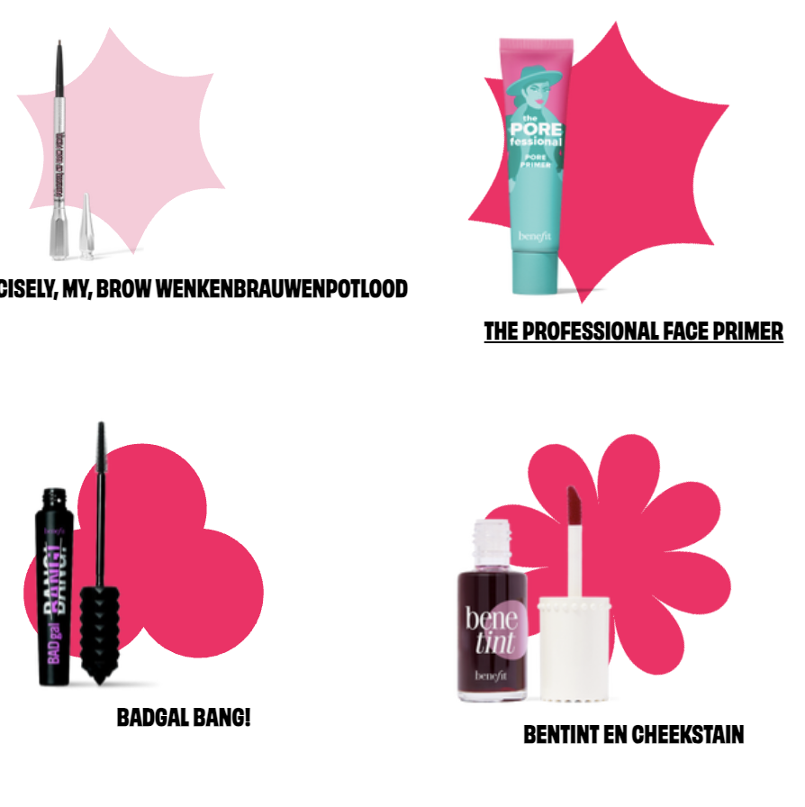
    

  ### Dit was lastig/Is niet gelukt:
  Korte omschrijving met plaatjes

  Op groot scherm moet de volledige inhoud van mijn footer zichtbaar zijn. Daarnaast moeten de pijltjes van de summary elementen op grote schermen verborgen worden, en de lijstitems ul binnen de summary moeten standaard open onder elkaar worden weergegeven. Dit is me niet helemaal gelukt, vooral het verbergen van de pijltjes vond ik lastig.

  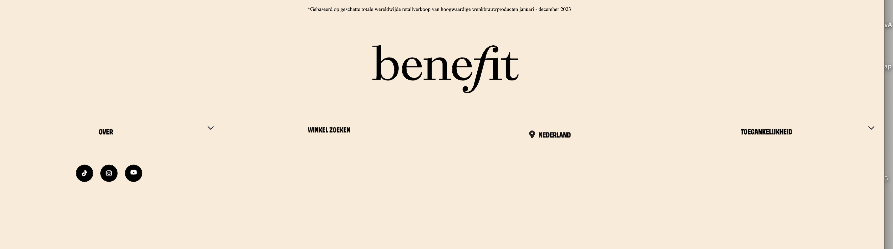

## Bronnenlijst

  
continu bijhouden terwijl je werkt

  Nb. Wees specifiek ('css-tricks' als bron is bijv. niet specifiek genoeg). 
  Nb. ChatGpT en andere AI horen er ook bij.
  Nb. Vermeld de bronnen ook in je code.

  1. <!--https://www.svgrepo.com/svg/513450/location-pin?edit=true-->
  2. <!--https://www.svgrepo.com/svg/473806/tiktok?edit=true-->
	3. <!-- https://developer.mozilla.org/en-US/docs/Web/SVG/Attribute/target -->
	4. <!--https://www.svgrepo.com/svg/513089/youtube-168?edit=true-->
  5. <!--https://codepen.io/studiojvla/pen/qVbQqW?editors=1100 -->
  6. <!--https://www.svgrepo.com/svg/513450/location-pin?edit=true-->
	7. <!--https://www.svgrepo.com/svg/473806/tiktok?edit=true-->
	8. <!-- https://developer.mozilla.org/en-US/docs/Web/SVG/Attribute/target -->
	9. <!--https://www.svgrepo.com/svg/513089/youtube-168?edit=true-->
  10. <!--https://codepen.io/studiojvla/pen/qVbQqW?editors=1100-->
  11. <!--https://codepen.io/SitePoint/pen/gOqYGPZ-->
  12. <!--> https://codepen.io/ayaalnabelsi/pen/RNrPrWW-->
  13. <!--https://codepen.io/SitePoint/pen/gOqYGPZ-->
  14. <!--https://codepen.io/SitePoint/pen/gOqYGPZ-->

